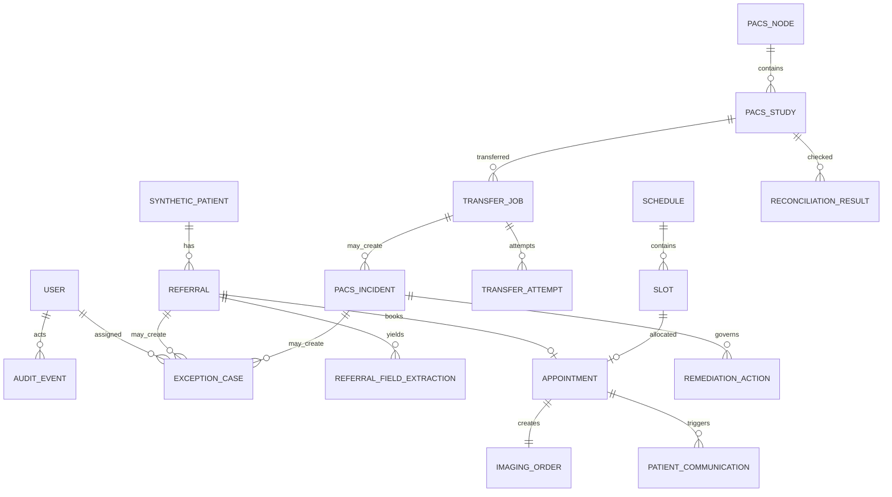

# Relational Data Model

PostgreSQL is the system of record. IDs are UUIDs and timestamps are timezone-aware UTC where present. Timestamp columns vary by implemented table; migrations are authoritative. Foreign keys use restrictive deletion by default. The application exposes no destructive DICOM or audit operation.

## Implementation status

This document includes both the implemented Phase 1–3 schema and later-phase target state. The following rows are **planned and not present** at this checkpoint: `refresh_sessions`, `automation_policies`, `idempotency_records`, `preparation_templates`, `waitlist_entries`, `patient_communications`, `pacs_events`, `pacs_incidents`, and `remediation_actions`. Constraints described for those rows are likewise target-state only. Current migrations through `0008_transfer_dispatch_outbox` are authoritative for implemented tables and indexes.

## Shared and identity

| Table | Important columns | Constraints / indexes |
|---|---|---|
| `users` | `id`, `email`, `display_name`, `password_hash`, `role`, `is_active` | case-sensitive unique email index; role enum; no public sign-up |
| `refresh_sessions` | `id`, `user_id`, `token_hash`, `expires_at`, `revoked_at` | token hash unique; index on user/expiry |
| `audit_events` | `id`, `timestamp`, `actor_type`, `actor_id`, `action`, `entity_type`, `entity_id`, `before_state`, `after_state`, `decision_reason`, `policy_version`, `model_name`, `prompt_version`, `correlation_id`, `request_id`, `source_ip`, `success`, `error_code`, `error_message` | append-only in service/API; indexes on time, entity, correlation, action |
| `exception_cases` | `id`, `exception_number`, `domain`, `category`, `severity`, `status`, `title`, `description`, `source_entity_type`, `source_entity_id`, `assigned_role`, `assigned_user_id`, `confidence`, `suggested_action`, `due_at`, `resolved_at`, `resolution` | exception number unique; domain/status/severity indexes |
| `automation_policies` | `id`, `domain`, `action_name`, `enabled`, `risk_level`, `requires_approval`, `maximum_attempts`, `confidence_threshold`, `conditions_json`, `version`, `effective_from`, `created_by` | unique action/version; check thresholds 0..1 and attempts >= 0 |
| `idempotency_records` | `id`, `scope`, `key`, `request_hash`, `response_json`, `status`, `expires_at` | unique `(scope,key)` |

## Scheduling

| Table | Relationships and constraints |
|---|---|
| `synthetic_patients` | unique `external_patient_id`; all records marked `synthetic=true`; fictional contact fields |
| `referrals` | FK patient; unique `referral_number`; unchanged `source_text`; modality/status/completeness enums; confidence 0..1 |
| `referral_field_extractions` | FK referral; one current row per referral/field; model/prompt identify the current extraction, audit events preserve prior runs, and original extracted value remains distinct from an accepted correction |
| `locations` | unique `code`; IANA timezone; active flag |
| `preparation_templates` | versioned deterministic message template; no clinical advice generation |
| `imaging_services` | FK location; globally unique code; duration stored as a required integer (positive-duration DB check is target-state) |
| `schedules` | FK service/location; valid date range |
| `slots` | FK schedule; status enum; required capacity and integer `version`; start/end and positive-capacity DB checks are target-state |
| `appointments` | FK patient/referral/slot/service; unique appointment and accession numbers; partial unique active appointment per referral; cancellation history preserved |
| `appointment_history` | immutable transition rows with actor, prior/new state, reason, timestamp |
| `imaging_orders` | one-to-one appointment; unique accession; procedure/modality/scheduled time |
| `waitlist_entries` | FK patient/referral/current appointment/offered slot; bounded offer expiry; status enum |
| `patient_communications` | FK patient/appointment; channel/template/version/body/status; local-only destination and MailHog result |

### Booking concurrency invariant

Inside one PostgreSQL transaction:

1. lock the slot row using `SELECT ... FOR UPDATE`;
2. require `status='free'` and expected `version`;
3. require no active appointment for the referral;
4. create appointment and imaging order;
5. mark slot busy and increment version;
6. append appointment history and audit event;
7. commit atomically.

No network call occurs while the row lock is held. Communication is queued after commit.

## PACS/RIS

| Table | Relationships and constraints |
|---|---|
| `pacs_nodes` | unique name/node type; base URL and DICOM endpoint; no credentials stored in row; last health status/time |
| `pacs_health_checks` | FK node; status, latency, HTTP evidence, redacted error, checked time |
| `pacs_studies` | FK node; unique `(node_id, orthanc_study_id)` and indexed study UID/accession/patient ID; normalized metadata JSON only, no pixels |
| `transfer_jobs` | FK source/destination/study; immutable UID/accession/patient/count intent snapshot; status, retry count/max, correlation and idempotency key; unique idempotency key |
| `transfer_attempts` | FK transfer; attempt number, timestamps, redacted request/response evidence, outcome; unique transfer/attempt |
| `pacs_events` | FKs to nodes/study/transfer; typed evidence and processing state |
| `pacs_incidents` | unique incident number; FK source event/study/transfer/owner; constrained category/severity/status/approval state |
| `remediation_actions` | FK incident; enum allowlisted action; risk, proposer/approver, execution state/result; unique incident/action/idempotency key |
| `reconciliation_results` | FK study/source/destination; identifiers and counts, match booleans, outcome, checked time |

### Transfer and retry invariants

- Phase 3 stores `retry_count` and `maximum_retries` but has no database check for their relationship; the Celery task disables automatic retries.
- Connectivity categories, confidence thresholds, a global kill switch, and destination-health retry eligibility are Phase 4 target policy controls, not current transfer invariants.
- Identity mismatch, unknown, duplicate, authorization, security/configuration, and non-allowlisted cases cannot execute automatically.
- Reconciliation closes a transfer only after both nodes match the immutable transfer intent and positive identifier/count checks succeed.
- No table or service contains pixel content or a method for deletion/tag modification.

## Relationship overview

## Retention and mutability

- Audit events, appointment history, transfer attempts, and reconciliation results are append-only through application logic.
- Cancellation/resolution changes status and appends history; it does not erase evidence.
- Demo reset is an explicit local administrative script that truncates/reseeds application data and resets synthetic Orthanc volumes; it is not exposed as an application API.
