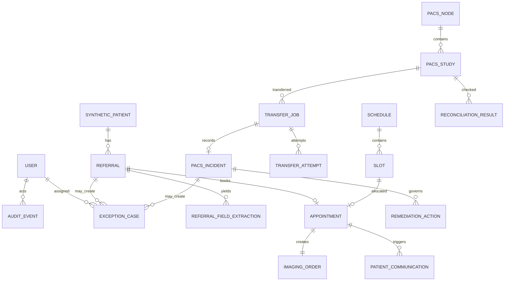

# Relational Data Model

PostgreSQL is the system of record. IDs are UUIDs and timestamps are timezone-aware UTC where present. Timestamp columns vary by implemented table; migrations are authoritative. Foreign keys use restrictive deletion by default. The application exposes no destructive DICOM or audit operation.

## Implementation status

This document includes implemented Phase 1–4 schema and later-phase target state. Implemented migrations currently run through `0010_pacs_incidents`. The following remain planned and are not present: `refresh_sessions`, `automation_policies`, `idempotency_records`, `preparation_templates`, `waitlist_entries`, `patient_communications`, `pacs_events`, and `remediation_actions`. Constraints described for those rows remain target-state only.

## Shared and identity

| Table | Important columns | Constraints / indexes |
|---|---|---|
| `users` | `id`, `email`, `display_name`, `password_hash`, `role`, `is_active` | case-sensitive unique email index; role enum; no public sign-up |
| `refresh_sessions` | `id`, `user_id`, `token_hash`, `expires_at`, `revoked_at` | target state: token hash unique; index on user/expiry |
| `audit_events` | `id`, `timestamp`, `actor_type`, `actor_id`, `action`, `entity_type`, `entity_id`, `before_state`, `after_state`, `decision_reason`, `policy_version`, `model_name`, `prompt_version`, `correlation_id`, `request_id`, `source_ip`, `success`, `error_code`, `error_message` | append-only in service/API; indexes on time, entity, correlation, action |
| `exception_cases` | `id`, `exception_number`, `domain`, `category`, `severity`, `status`, `title`, `description`, `source_entity_type`, `source_entity_id`, `assigned_role`, `assigned_user_id`, `confidence`, `suggested_action`, `due_at`, `resolved_at`, `resolution` | exception number unique; domain/status/severity indexes |
| `automation_policies` | target-state versioned policy configuration and thresholds |
| `idempotency_records` | target-state request idempotency records |

## Scheduling

Implemented scheduling tables retain the booking concurrency invariant: lock the slot, validate status/version and references, create appointment/order, mark the slot busy, append history/audit, and commit atomically. No network call occurs while the row lock is held.

## PACS/RIS

| Table | Relationships and constraints |
|---|---|
| `pacs_nodes` | unique name/adapter key; base URL and DICOM endpoint; no credentials stored in row; last health status/time |
| `pacs_health_checks` | FK node; status, latency, HTTP evidence, redacted error, checked time |
| `pacs_studies` | FK node; unique `(node_id, orthanc_study_id)` and indexed study UID/accession/patient ID; normalized metadata JSON only, no pixels |
| `transfer_jobs` | FK source/destination/study; immutable UID/accession/patient/count intent snapshot; status, retry count/max, correlation and idempotency key; unique idempotency key |
| `transfer_attempts` | FK transfer; attempt number, timestamps, redacted request/response evidence, outcome; unique transfer/attempt |
| `pacs_incidents` | **Implemented in migration 0010**; unique transfer-job link; study/source/destination FKs; constrained taxonomy/severity/status/approval state; confidence/rule/evidence; redacted summary; repeated-failure count |
| `pacs_events` | target-state typed PACS event evidence |
| `remediation_actions` | target-state allowlisted action, risk, proposer/approver, execution state/result, and idempotency key |
| `reconciliation_results` | FK study/source/destination; identifiers and counts, match booleans, outcome, checked time |

### Transfer and retry invariants

- Transfer intent and the started attempt are committed before the external DICOM store.
- External failures are classified deterministically and persisted as human-review incidents; the current worker does not auto-retry.
- A unique transfer-job incident and savepoint upsert consolidate repeated failure evidence.
- Connectivity classification is not authorization to retry. Future execution requires persisted approval, policy gates, fresh destination health, and a final pre-action recheck.
- Identity mismatch, unknown, duplicate, authorization, security/configuration, and non-allowlisted cases cannot execute automatically.
- Reconciliation closes a transfer only after both nodes match the immutable transfer intent and positive identifier/count checks succeed.
- No table or service contains pixel content or a method for deletion/tag modification.

## Relationship overview

## Retention and mutability

- Audit events, appointment history, transfer attempts, and reconciliation results are append-only through application logic.
- PACS incident evidence consolidates repeated failures in one row and appends a corresponding audit event; resolution fields preserve human disposition.
- Cancellation/resolution changes status and appends history; it does not erase evidence.
- Demo reset is an explicit local administrative script that truncates/reseeds application data and resets synthetic Orthanc volumes; it is not exposed as an application API.
