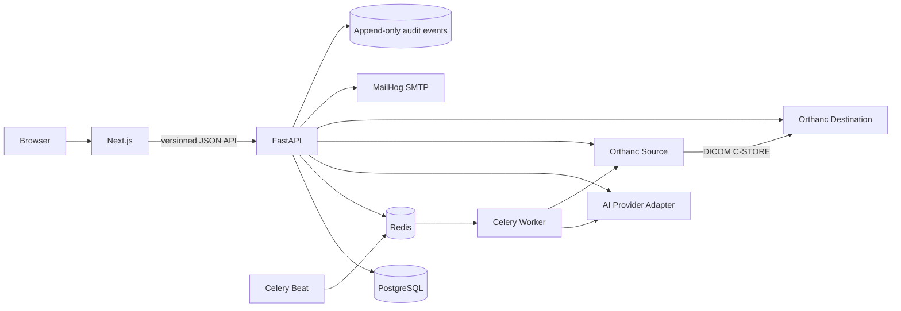

# ADR-0001: Local-first modular monolith with isolated automation adapters

- **Status:** Accepted
- **Date:** 2026-07-19
- **Decision owners:** Product engineering, solution architecture, quality engineering
- **Source of truth:** `D:\Downloads\radiology_operations_copilot_local_codex_spec.md`

## Context

Radiology Operations Copilot is a synthetic healthcare-operations portfolio prototype with two distinct workspaces: **Scheduling Automation** and **PACS/RIS Automation**. It must demonstrate realistic workflow orchestration, human oversight, strict AI boundaries, transactional scheduling, real local Orthanc interactions, background jobs, and complete audit evidence without relying on hosted infrastructure.

The prototype must be simple enough to run on one development laptop while preserving boundaries that could support later decomposition. It must fail safely when AI, Orthanc, Redis, or email is unavailable.

## Decision

Build a Docker Compose–orchestrated modular monolith:

- A Next.js App Router frontend renders the two primary workspaces and shared operations views.
- A FastAPI backend owns authentication, authorization, domain rules, transactions, audit recording, and integration orchestration.
- PostgreSQL is the system of record.
- Redis is the Celery broker/result backend; Celery worker and beat execute bounded background tasks.
- Two isolated Orthanc instances represent source and destination PACS.
- MailHog captures all local-only email.
- AI and Orthanc are behind typed adapters. A deterministic mock AI provider is the default and makes offline demos reproducible.
- Domain modules are separated inside the backend (`scheduling`, `pacs_ops`, `exceptions`, `audit`, `analytics`, `rules`, `ai`, and `integrations`) rather than deployed as independent services.

## Safety invariants

1. Only explicitly synthetic data is accepted; every page displays the synthetic-data warning.
2. The product never interprets images, diagnoses, provides medical advice, or determines clinical appropriateness.
3. No application route, adapter method, task, or UI control may delete a DICOM study/instance, modify pixels, or alter identity tags.
4. AI responses are untrusted data. Every response is parsed with `extra="forbid"` Pydantic schemas and rejected on validation failure.
5. AI outputs can recommend only enum-constrained classifications/runbooks/actions. They never invoke adapters or privileged code directly.
6. Deterministic policies run after AI validation and before a proposal is created or executed.
7. Identity conflict, clinical ambiguity, security/configuration change, unknown classification, destructive action, and non-allowlisted action always stop automation and create/retain human review.
8. Protected routes enforce backend RBAC; hidden UI controls are not authorization.
9. Audit events are append-only through application code and capture actor, reason, rule/prompt/model version, correlation/request IDs, before/after evidence, and outcome.
10. Booking uses a database transaction and slot row lock/version check. External retries use idempotency keys and hard attempt limits.

## Trust boundaries

- **Browser → API:** untrusted input; validate, authenticate, authorize, rate-limit sensitive endpoints.
- **Referral/log text → AI:** untrusted content; delimit as data, ignore embedded instructions, strict schema, no tools.
- **AI → policy engine:** advisory only; deterministic allowlist and confidence checks are authoritative.
- **API/worker → Orthanc:** credentials remain server-side; adapter exposes no destructive methods.
- **API → SMTP:** MailHog host only in MVP; deterministic appointment fields override generated prose.
- **Containers → host:** only required local ports are published; internal service traffic uses a private Compose network.

## Key implementation decisions

### Authentication

Application-owned seeded users, Argon2 password hashes, short-lived JWT access tokens stored in HttpOnly cookies, no sign-up, and role checks on every protected route. The interface remains replaceable.

### Data and audit

Use SQLAlchemy 2.x and Alembic. UUID primary keys are application generated. Timestamps are timezone-aware UTC. JSONB stores bounded evidence and structured model payloads, not image pixels. Audit records have no update/delete API.

### Background work

Celery tasks receive entity IDs and idempotency keys, not ORM objects or free-form executable instructions. Phase 3 transfer tasks re-load entity state and execute with automatic retries disabled; current-policy reload and policy-driven retry eligibility are Phase 4 target controls. Beat health/inventory tasks tolerate Orthanc unavailability.

### AI

`AIProvider` protocol supports a deterministic mock and an OpenAI-compatible HTTP provider configured entirely through environment variables. Prompt files are versioned. Raw records are redacted and bounded. AI failure leaves manual processing available.

### PACS

`PacsAdapter` exposes health, inventory, get, send, and reconcile operations only. Transfers are initiated through source Orthanc and verified against destination metadata. No pixel data is persisted in PostgreSQL.

## Consequences

### Positive

- One-command local topology demonstrates all required infrastructure.
- Domain and adapter boundaries remain testable without external providers.
- Transactions and audit evidence stay centralized.
- The deterministic mock supports repeatable portfolio demonstrations.

### Trade-offs

- The API is a larger deployable unit than independently scalable microservices.
- Celery/PostgreSQL coordination requires careful idempotency; it is not a distributed transaction.
- Local JWT/cookie authentication is illustrative, not an enterprise identity solution.
- Orthanc failure simulation requires Docker access and operational scripts.

## Rejected alternatives

- **Cloud database/auth/queue/storage:** violates local-first MVP scope.
- **Microservices per domain:** adds deployment and consistency complexity without MVP value.
- **AI agents with tools:** violates the requirement that AI text cannot execute privileged actions.
- **Direct DICOM filesystem access:** bypasses Orthanc’s supported interface and weakens auditability.
- **SQLite:** insufficiently representative for row locking, concurrency, and PostgreSQL JSONB behavior.

## Verification

This is the target acceptance condition, not a claim that every later-phase workflow exists. The decision is fully satisfied only when `docker compose up --build` starts the complete stack; health checks pass; seeded users can log in; both tabs render; PostgreSQL/Redis/Celery/Orthanc/MailHog integrations are exercised; safety and authorization tests pass; and the eventual connected demo produces its intended audit timeline. Phase reports record the narrower evidence available at each checkpoint.
